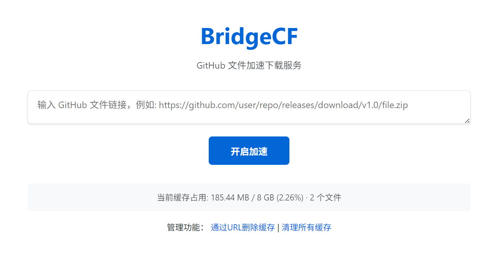

# BridgeCF

## 项目简介

BridgeCF 是一个基于 Cloudflare Workers 的 GitHub 文件加速下载服务。它通过缓存机制，解决了 GitHub 在某些地区下载速度慢的问题，提供更快速、更稳定的文件下载体验。

## 功能特点

- **GitHub 文件加速下载**：支持 GitHub 仓库中的文件、Release 附件等资源的加速下载
- **智能缓存机制**：自动缓存下载过的文件，为后续用户提供更快的访问速度
- **自动清理过期文件**：定期清理长时间未访问的文件，确保存储空间合理使用
- **流式传输大文件**：优化处理大文件下载，支持大于 100MB 的文件流式传输
- **管理功能**：提供缓存管理界面，支持清理指定文件或全部缓存

## 部署指南

### 前提条件

- Cloudflare 账号
- 已开通 Workers 服务（免费计划即可）
- 已开通 R2 存储服务（用于缓存文件）
- 已开通 D1 数据库服务（用于存储下载记录）

### 部署步骤

1. 登录 Cloudflare Dashboard，创建 **R2存储桶** 和 **D1数据库** 备用
2. **为刚刚创建的R2存储桶设定一个自定义域**
3. 进入 Workers & Pages，**创建一个新的 Worker**
4. **将 `_workers.js` 文件的全部内容复制粘贴到 Workers 编辑器中**
5. **在"设置"标签页中配置以下绑定**:
   - **R2 存储桶**: 添加绑定名称 `R2_BUCKET` 指向您创建的 R2 存储桶
   - **D1 数据库**: 添加绑定名称 `DB` 指向您创建的 D1 数据库
   - **环境变量**:
     - `MAX_STORAGE_SIZE`: 最大存储容量，单位GB（默认：8）
     - `FILE_EXPIRY_DAYS`: 文件过期天数（默认：30）
     - `R2_PUBLIC_URL`: 您的 R2 存储桶自定义域名，**只需填写域名**（例如：`files.example.com`），**不要包含 `https://` 前缀或路径，结尾也不要包含斜杠**
     - `ADMIN_TOKEN`: 管理员令牌（自定义一个安全的值，用于访问管理功能。默认值：hcllmsx-BridgeCF）
   - **计划任务(Cron Triggers)**: 添加 `0 0 * * *`（每天运行一次）
6. **保存并部署**

## 使用说明

### 基本使用

1. 访问您部署的 Worker URL（例如 `https://bridgecf.your-subdomain.workers.dev`）
2. 在输入框中粘贴 GitHub 文件链接，例如:
   - `https://github.com/user/repo/releases/download/v1.0/file.zip`
   - `https://github.com/user/repo/raw/master/example.zip`
   - 任何来自 `github.com`、`raw.githubusercontent.com` 或 `.github.io` 的链接
3. 点击 **开启加速** 按钮
4. 等待处理完成后，点击 **点击下载** 按钮下载文件

### 管理功能

#### 通过 URL 删除缓存

1. 在首页点击 **通过URL删除缓存** 链接
2. 输入您设置的 `ADMIN_TOKEN`（若未设置，使用默认值：hcllmsx-BridgeCF）
3. 在管理页面中，输入要删除的 GitHub 文件链接
4. 点击 **删除缓存** 按钮

#### 清理所有缓存

1. 在首页点击 **清理所有缓存** 链接
2. 输入您设置的 `ADMIN_TOKEN`（若未设置，使用默认值：hcllmsx-BridgeCF）
3. 系统会删除所有缓存文件和下载记录

## 技术实现

- **前端**：纯 HTML、CSS 和 JavaScript，内嵌在 Worker 代码中
- **后端**：Cloudflare Worker (JavaScript)
- **存储**：Cloudflare R2 用于文件存储
- **数据库**：Cloudflare D1 用于记录下载信息
- **定时任务**：使用 Cron Triggers 定期清理过期文件

## 感谢 [**Cloudflare**](https://www.cloudflare-cn.com/) 赛博活佛！

## 许可证

MIT License

---

© 2025 [BridgeCF](https://github.com/hcllmsx/BridgeCFworkers) 